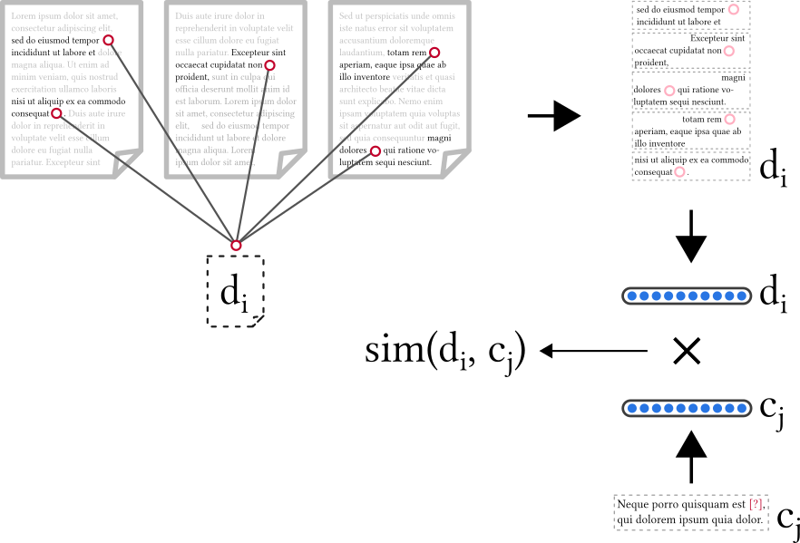

# Semantic Approaches to Citation Reommendation

Semantic modelling of citation contexts for the purpose of citation recommendation.

* Thesis [[report](report/thesis_main.pdf) | [presentation](pres/pres.pdf)]
* Data Set [[paper](http://ceur-ws.org/Vol-2345/paper2.pdf) | [data](https://doi.org/10.5281/zenodo.2609187) | [code](https://github.com/IllDepence/unarXive) | [presentation](misc/bir_presentation/bir2019.pdf) | [poster](misc/bir_presentation/poster.pdf)]

### Abstract
New research is being published at a rate, at which it is infeasible for many scholars, to read and assess everything possibly relevant to their work. In pursuit of a remedy, efforts towards automated processing of publications, like semantic modelling of papers to facilitate their digital handling, and the development of information filtering systems, are an active area of research. In this thesis, we investigate the semantic modelling of citation contexts for the purpose of citation recommendation. For this, we generate a large data set with accurate citation information from LaTeX sources of publications on arXiv.org. Using this data set, we develop semantic recommendation models based on entities and claim structures. To assess the effectiveness and conceptual soundness of our models, we perform a large offline evaluation on our own as well as several established data sets and furthermore conduct a user study. Our findings show, that the models can outperform a non-semantic baseline model and do, indeed, capture the kind of information they're conceptualized for.

